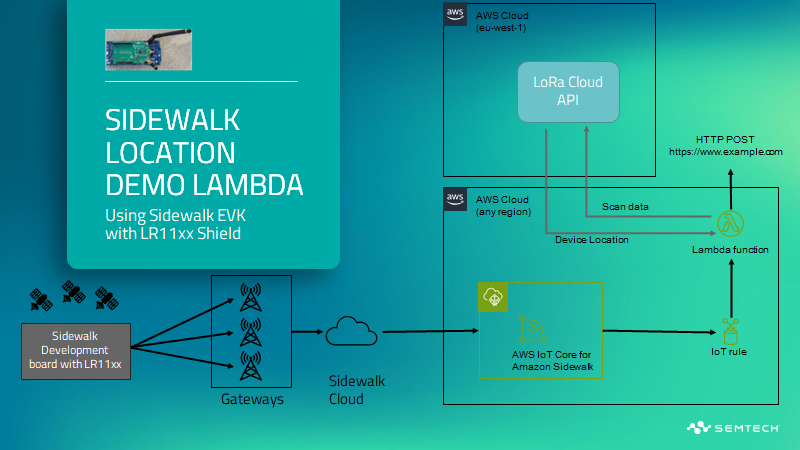

# Example AWS Lamba for Sidewalk Data Processing
---

This is an example using the [Serverless Framework](https://serverless.com), 
Python, AWS Lambda and AWS IoT Core Sidewalk o interface between 
the LoRa Edge(TM) development build for Sidewalk and the LoRa Cloud. This code 
first converts the CSS/LoRa fragments into a data payload. These data payloads 
can include WiFi and GNSS scans which can be passed to LoRa Cloud for position 
computation. Note that the original example is built around GNSS, but the 
fragmentation/defragmentation protocol does support mulitple scan types. While 
this example is developed for AWS Lambda using AWS IoT Core Wireless functions, 
it could be simply adapted to other platforms or environments as required.

For more information please see: https://lora-developers.semtech.com/solutions/lora-edge-asset-management/

---

# Project Architecture

# Installation Instructions

## Prerequisites

1. Clone this repo
2. AWS Account with permissions to create Lambda functions and DyamoDB tables

# Installation & Deployment

1. Add python code as a Lambda function
2. Create an IoT Core trigger on destination for Sidewalk data
3. Enable read/write access to DynamoDB

	Create table called 'frag-test-CND36VJ1W901' with a string primary key of "wdid" and a number sort key of "TSTAMPMS"

	Create table called 'dedup-CND36VJ1W901' with a string primary key of "wdid" and a number sort key of "TSTAMPMS"

4. Enable read/write access to iotwireless
5. Enable read/write access to DynamoDB
6. Enable write access to CloudWatch logs
